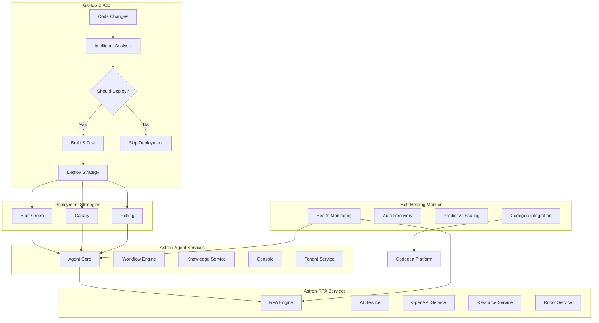

# 🤖 Autonomous Deployment Guide: Astron-Agent + Astron-RPA

This guide provides comprehensive instructions for deploying the integrated Astron-Agent and Astron-RPA platforms with autonomous orchestration capabilities.

## 🎯 Overview

The autonomous deployment system combines:
- **Intelligent Decision Making**: AI-powered deployment decisions based on code changes and system health
- **Self-Healing**: Automatic issue detection and recovery mechanisms
- **Codegen Integration**: Continuous development feedback loops with the Codegen platform
- **Multi-Platform Orchestration**: Seamless integration between Astron-Agent and Astron-RPA

## 🏗️ Architecture



## 🚀 Quick Start

### Prerequisites

1. **GitHub Repository Access**: Both `astron-agent` and `astron-rpa` repositories
2. **Docker & Docker Compose**: For containerized deployment
3. **Codegen API Key**: For autonomous feedback loops
4. **Environment Variables**: Configured secrets in GitHub

### 1. Environment Setup

```bash
# Clone both repositories
git clone https://github.com/Zeeeepa/astron-agent.git
git clone https://github.com/Zeeeepa/astron-rpa.git

# Set up environment variables
cp deployment/.env.example .env
# Edit .env with your configuration
```

### 2. Configure GitHub Secrets

Add these secrets to your GitHub repository:

```yaml
# Database Configuration
MYSQL_ROOT_PASSWORD: your_mysql_root_password
MYSQL_PASSWORD: your_mysql_password
REDIS_PASSWORD: your_redis_password

# Storage Configuration
MINIO_ROOT_USER: your_minio_user
MINIO_ROOT_PASSWORD: your_minio_password

# Codegen Integration
CODEGEN_API_KEY: your_codegen_api_key
CODEGEN_BASE_URL: https://api.codegen.com

# Monitoring
GRAFANA_PASSWORD: your_grafana_password
ALERT_WEBHOOK_URL: your_alert_webhook_url

# AI Services
AI_MODEL_API_KEY: your_ai_model_api_key
```

### 3. Deploy the System

#### Option A: Automatic Deployment (Recommended)

Push changes to trigger autonomous deployment:

```bash
git add .
git commit -m "feat: enable autonomous deployment"
git push origin main
```

The system will automatically:
1. Analyze code changes and system health
2. Make intelligent deployment decisions
3. Execute appropriate deployment strategy
4. Monitor and self-heal if issues arise

#### Option B: Manual Deployment

```bash
# Deploy using Docker Compose
docker-compose -f deployment/docker-compose.master.yml up -d

# Or trigger specific deployment mode
gh workflow run "Autonomous Deployment Orchestration" \
  --field deployment_mode=intelligent \
  --field target_environment=staging
```

## 🧠 Intelligent Decision Making

The system uses AI-powered decision making based on multiple factors:

### Risk Assessment Factors

| Factor | Weight | Description |
|--------|--------|-------------|
| Code Changes | 30% | Files changed, lines modified, breaking changes |
| System Health | 25% | Current service availability and performance |
| Compatibility | 20% | Astron-RPA integration compatibility |
| Historical Success | 15% | Recent deployment success rates |
| Time Factors | 10% | Deployment timing (avoid peak hours, Fridays) |

### Deployment Strategies

Based on risk level, the system automatically selects:

- **Low Risk (0-30%)**: Rolling deployment
- **Medium Risk (30-50%)**: Canary deployment (10% → 50% → 100%)
- **High Risk (50-70%)**: Blue-green deployment
- **Critical Risk (70%+)**: Skip deployment

### Decision Override

You can override intelligent decisions:

```bash
# Force deployment regardless of risk
gh workflow run "Autonomous Deployment Orchestration" \
  --field deployment_mode=force \
  --field target_environment=staging

# Trigger rollback
gh workflow run "Autonomous Deployment Orchestration" \
  --field deployment_mode=rollback \
  --field target_environment=staging
```

## 🔧 Self-Healing Capabilities

The autonomous monitoring system provides:

### Health Monitoring

- **Real-time Health Checks**: All services monitored every 30 seconds
- **Performance Metrics**: Response time, error rate, throughput, availability
- **Resource Monitoring**: CPU, memory, disk usage tracking
- **Integration Status**: Astron-Agent ↔ Astron-RPA communication health

### Automatic Recovery Actions

| Issue Level | Actions |
|-------------|---------|
| **Warning** | Send alerts, log issues |
| **Degraded** | Scale up resources, restart if needed |
| **Critical** | Immediate restart, aggressive scaling, trigger Codegen intervention |

### Self-Healing Configuration

```yaml
# deployment/config/monitoring.yml
check_interval: 30  # seconds
thresholds:
  response_time: 2000  # ms
  error_rate: 5.0      # %
  cpu_usage: 80.0      # %
  memory_usage: 80.0   # %
  availability: 99.0   # %

healing:
  max_restart_attempts: 3
  restart_cooldown: 300  # seconds
  scale_up_threshold: 0.8
  scale_down_threshold: 0.3

codegen:
  intervention_threshold: critical
  api_key: ${CODEGEN_API_KEY}
```

## 🔄 Codegen Platform Integration

### Continuous Feedback Loop

The system automatically:

1. **Collects Performance Data**: Every hour
2. **Sends Health Reports**: System status and metrics
3. **Requests Optimizations**: AI-powered recommendations
4. **Creates Autonomous Tasks**: For high-impact, low-effort improvements

### Integration Features

- **Deployment Registration**: Track all deployments
- **Performance Analytics**: Historical trends and insights
- **Optimization Recommendations**: AI-powered suggestions
- **Autonomous Task Creation**: Automatic issue resolution
- **Predictive Scaling**: Based on usage patterns

### Manual Integration Commands

```bash
# Register a deployment
python deployment/scripts/codegen_integration.py \
  --action register_deployment \
  --environment staging \
  --version v1.2.3 \
  --deployment-metadata deployment_metadata.json

# Start feedback loop
python deployment/scripts/codegen_integration.py \
  --action start_feedback_loop \
  --environment staging \
  --feedback-interval 3600

# Get deployment insights
python deployment/scripts/codegen_integration.py \
  --action get_insights \
  --environment staging
```

## 📊 Monitoring & Observability

### Access Points

- **Grafana Dashboard**: http://localhost:3000 (admin/astron_grafana_2024)
- **Prometheus Metrics**: http://localhost:9090
- **Jaeger Tracing**: http://localhost:16686
- **Astron-Agent Console**: http://localhost:3001
- **Astron-RPA Console**: http://localhost:3002

### Key Metrics

- **Service Health**: Individual service status and uptime
- **Integration Status**: Agent ↔ RPA communication health
- **Performance Metrics**: Response times, throughput, error rates
- **Resource Usage**: CPU, memory, storage utilization
- **Deployment Success**: Success rates and rollback frequency

### Alerts Configuration

```yaml
# Automatic alerts for:
- Error rate > 5%
- Response time > 2000ms
- Service availability < 99%
- RPA integration failure
- Resource usage > 80%
```

## 🔒 Security & Compliance

### Security Features

- **Secret Management**: GitHub Secrets integration
- **Network Isolation**: Docker network segmentation
- **Health Check Authentication**: Secure endpoint monitoring
- **Audit Logging**: Complete deployment audit trail

### Compliance

- **Deployment Tracking**: Full deployment history
- **Change Management**: Automated change documentation
- **Rollback Capability**: Immediate rollback on issues
- **Security Scanning**: Automated vulnerability checks

## 🛠️ Troubleshooting

### Common Issues

#### Deployment Fails

```bash
# Check deployment logs
docker-compose -f deployment/docker-compose.master.yml logs

# Check individual service health
curl http://localhost:8000/health  # Astron-Agent Core
curl http://localhost:19999/health # Astron-RPA Engine
```

#### Self-Healing Not Working

```bash
# Check monitoring service
docker logs astron-self-healing-monitor

# Verify configuration
cat deployment/config/monitoring.yml
```

#### Codegen Integration Issues

```bash
# Test API connectivity
python deployment/scripts/codegen_integration.py \
  --action send_health_report \
  --environment staging

# Check API key configuration
echo $CODEGEN_API_KEY
```

### Debug Mode

Enable debug logging:

```bash
# Set environment variable
export LOG_LEVEL=DEBUG

# Or in docker-compose
LOG_LEVEL=DEBUG docker-compose -f deployment/docker-compose.master.yml up -d
```

## 📈 Performance Optimization

### Automatic Optimizations

The system automatically:
- **Scales services** based on load patterns
- **Optimizes resource allocation** based on usage
- **Implements recommendations** from Codegen AI
- **Adjusts monitoring thresholds** based on performance

### Manual Optimizations

```bash
# Scale specific service
docker-compose -f deployment/docker-compose.master.yml up -d --scale astron-agent-core=3

# Update resource limits
# Edit docker-compose.master.yml and restart services
```

## 🔮 Advanced Features

### Custom Deployment Strategies

Create custom deployment strategies by extending:

```python
# deployment/scripts/custom_deploy.py
class CustomDeploymentStrategy:
    def execute(self, environment, version, config):
        # Your custom deployment logic
        pass
```

### Custom Health Checks

Add service-specific health checks:

```python
# deployment/scripts/custom_health_checks.py
async def custom_health_check(service_name, endpoint):
    # Your custom health check logic
    return health_status, metrics
```

### Integration Extensions

Extend Codegen integration:

```python
# deployment/scripts/custom_codegen_integration.py
class CustomCodegenIntegration(CodegenIntegration):
    async def custom_optimization(self, context):
        # Your custom optimization logic
        pass
```

## 📚 Additional Resources

- [Astron-Agent Documentation](./README.md)
- [Astron-RPA Documentation](../astron-rpa/README.md)
- [Docker Compose Reference](./deployment/docker-compose.master.yml)
- [GitHub Actions Workflow](./.github/workflows/autonomous-deploy.yml)
- [Monitoring Configuration](./deployment/config/monitoring.yml)

## 🤝 Contributing

To contribute to the autonomous deployment system:

1. Fork the repository
2. Create a feature branch: `git checkout -b feature/autonomous-enhancement`
3. Make your changes
4. Test with the autonomous deployment system
5. Submit a pull request

## 📞 Support

For support with autonomous deployment:

1. **GitHub Issues**: Create an issue with the `deployment` label
2. **Codegen Platform**: Use the integrated support system
3. **Documentation**: Check this guide and linked resources
4. **Monitoring**: Check Grafana dashboards for system status

---

**🚀 Ready to deploy autonomously? The future of deployment is here!**
