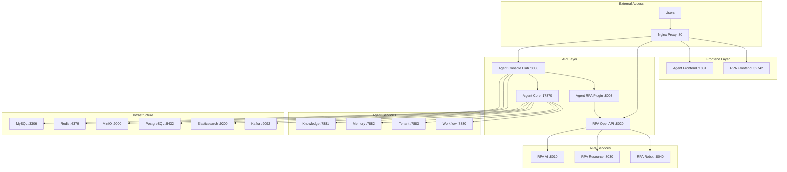
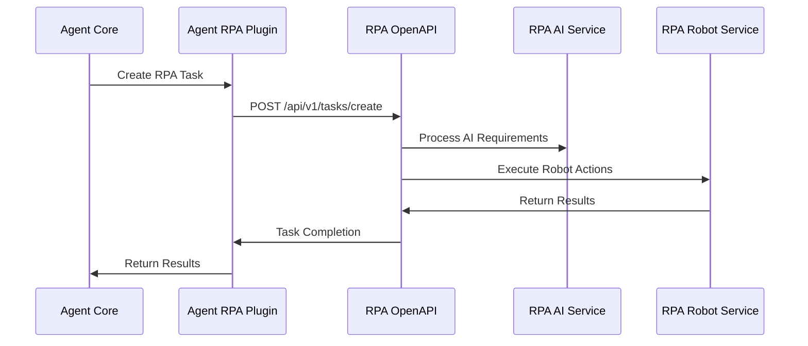

# 🚀 Unified Deployment Guide: astron-agent + astron-rpa

This guide provides comprehensive instructions for deploying both astron-agent and astron-rpa systems in a unified, integrated environment.

## 📋 Table of Contents

- [🎯 Overview](#-overview)
- [⚡ Quick Start](#-quick-start)
- [🔧 Prerequisites](#-prerequisites)
- [📦 Installation](#-installation)
- [🌐 Access Interfaces](#-access-interfaces)
- [🔗 Service Integration](#-service-integration)
- [📊 Monitoring](#-monitoring)
- [🛠️ Management](#-management)
- [🔒 Security](#-security)
- [🐛 Troubleshooting](#-troubleshooting)
- [📚 Advanced Configuration](#-advanced-configuration)

## 🎯 Overview

This unified deployment integrates two powerful platforms:

- **astron-agent**: AI agent orchestration platform with plugin architecture
- **astron-rpa**: Complete RPA (Robotic Process Automation) platform

### 🏗️ Architecture



### ✨ Key Features

- **🔄 Unified Deployment**: Single command deployment of both platforms
- **🔗 Seamless Integration**: astron-agent RPA plugin connects to astron-rpa services
- **🌐 Unified Access**: Single entry point through Nginx reverse proxy
- **📊 Comprehensive Monitoring**: Health checks, logging, and metrics
- **🔒 Security**: Authentication, SSL support, and network isolation
- **📈 Scalability**: Docker-based architecture with scaling capabilities

## ⚡ Quick Start

### 1. Clone and Deploy

```bash
# Clone the repository
git clone <repository-url>
cd astron-agent

# Run the deployment script
./deploy.sh
```

### 2. Access the Platforms

- **🤖 RPA Platform**: http://localhost/rpa/
- **🧠 Agent Console**: http://localhost/agent/
- **🔐 Authentication**: http://localhost/auth/

### 3. Verify Deployment

```bash
# Check system health
./scripts/health-check.sh

# View service status
./scripts/manage-services.sh status
```

## 🔧 Prerequisites

### System Requirements

| Component | Minimum | Recommended |
|-----------|---------|-------------|
| **CPU** | 4 cores | 8+ cores |
| **RAM** | 8 GB | 16+ GB |
| **Storage** | 50 GB | 100+ GB |
| **OS** | Linux/macOS | Ubuntu 20.04+ |

### Software Dependencies

- **Docker**: 20.10+
- **Docker Compose**: 2.0+
- **Git**: 2.0+
- **curl**: 7.0+
- **jq**: 1.6+ (optional, for JSON processing)

### Network Requirements

The following ports must be available:

| Port | Service | Description |
|------|---------|-------------|
| 80 | Nginx | HTTP access |
| 443 | Nginx | HTTPS access (optional) |
| 3306 | MySQL | Database |
| 5432 | PostgreSQL | Database |
| 6379 | Redis | Cache |
| 9000 | MinIO | Object storage |
| 9200 | Elasticsearch | Search engine |
| 9092 | Kafka | Message broker |

## 📦 Installation

### Automated Installation

```bash
# Standard deployment
./deploy.sh

# Skip dependency checks
./deploy.sh --skip-deps

# Enable monitoring
./deploy.sh --enable-monitoring

# Production deployment
./deploy.sh --production
```

### Manual Installation

1. **Install Dependencies**
   ```bash
   # Ubuntu/Debian
   sudo apt-get update
   sudo apt-get install -y docker.io docker-compose git curl jq
   
   # CentOS/RHEL
   sudo yum install -y docker docker-compose git curl jq
   
   # macOS
   brew install docker docker-compose git curl jq
   ```

2. **Configure Environment**
   ```bash
   # Copy environment template
   cp .env.unified .env.local
   
   # Edit configuration
   nano .env.local
   ```

3. **Deploy Services**
   ```bash
   # Start infrastructure
   docker-compose -f docker-compose.unified.yml --env-file .env.local up -d mysql redis minio postgres elasticsearch kafka
   
   # Start RPA services
   docker-compose -f docker-compose.unified.yml --env-file .env.local up -d casdoor rpa-ai-service rpa-openapi-service rpa-resource-service rpa-robot-service rpa-frontend
   
   # Start Agent services
   docker-compose -f docker-compose.unified.yml --env-file .env.local up -d agent-core-agent agent-core-rpa agent-core-knowledge agent-core-memory agent-core-tenant agent-core-workflow agent-console-frontend agent-console-hub
   
   # Start proxy
   docker-compose -f docker-compose.unified.yml --env-file .env.local up -d nginx
   ```

## 🌐 Access Interfaces

### Web Interfaces

| Interface | URL | Description | Default Credentials |
|-----------|-----|-------------|-------------------|
| **RPA Platform** | http://localhost/rpa/ | Complete RPA interface | See Casdoor |
| **Agent Console** | http://localhost/agent/ | Agent management console | See configuration |
| **Authentication** | http://localhost/auth/ | Casdoor auth service | admin/123 |
| **MinIO Console** | http://localhost/minio/ | Object storage admin | unified-admin/UnifiedMinio123! |

### API Endpoints

| API | URL | Description | Authentication |
|-----|-----|-------------|----------------|
| **RPA API** | http://localhost/rpa/api/ | RPA platform API | API Key |
| **Agent API** | http://localhost/agent/api/ | Agent console API | JWT Token |
| **Agent Core** | http://localhost/agent/core/ | Core agent API | API Key |
| **RPA Plugin** | http://localhost/agent/rpa/ | RPA integration API | API Key |

### Direct Service Access

| Service | URL | Purpose |
|---------|-----|---------|
| RPA AI Service | http://localhost:8010 | AI processing |
| RPA OpenAPI | http://localhost:8020 | API gateway |
| RPA Resource | http://localhost:8030 | Resource management |
| RPA Robot | http://localhost:8040 | Robot execution |
| Agent Core | http://localhost:17870 | Core agent service |
| Agent RPA Plugin | http://localhost:8003 | RPA integration |

## 🔗 Service Integration

### RPA Integration Flow



### Configuration

The integration is configured through environment variables:

```bash
# RPA Integration URLs
XIAOWU_RPA_TASK_CREATE_URL=http://rpa-openapi-service:8020/api/v1/tasks/create
XIAOWU_RPA_TASK_QUERY_URL=http://rpa-openapi-service:8020/api/v1/tasks
RPA_AI_SERVICE_URL=http://rpa-ai-service:8010
RPA_RESOURCE_SERVICE_URL=http://rpa-resource-service:8030
RPA_ROBOT_SERVICE_URL=http://rpa-robot-service:8040

# Authentication
RPA_API_KEY=unified-rpa-api-key-2024
RPA_API_SECRET=unified-rpa-secret-key-2024
```

## 📊 Monitoring

### Health Checks

```bash
# Comprehensive health check
./scripts/health-check.sh

# Specific checks
./scripts/health-check.sh --containers
./scripts/health-check.sh --services
./scripts/health-check.sh --resources

# Continuous monitoring
./scripts/health-check.sh --watch
```

### Service Status

```bash
# View all service status
./scripts/manage-services.sh status

# View logs
./scripts/manage-services.sh logs [service]

# Follow logs in real-time
./scripts/manage-services.sh follow [service]
```

### Metrics and Monitoring

Enable monitoring with Prometheus and Grafana:

```bash
# Deploy with monitoring
./deploy.sh --enable-monitoring

# Access monitoring interfaces
# Grafana: http://localhost:3000 (admin/admin123)
# Prometheus: http://localhost:9090
```

## 🛠️ Management

### Service Management

```bash
# Start services
./scripts/manage-services.sh start [group]

# Stop services
./scripts/manage-services.sh stop [group]

# Restart services
./scripts/manage-services.sh restart [group]

# Scale services
./scripts/manage-services.sh scale <service> <replicas>
```

Service groups:
- `infra`: Infrastructure services
- `rpa`: RPA platform services
- `agent`: Agent platform services
- `proxy`: Reverse proxy
- `all`: All services (default)

### Data Management

```bash
# Create backup
./scripts/manage-services.sh backup

# Update services
./scripts/manage-services.sh update

# Clean up system
./scripts/manage-services.sh cleanup

# Reset system (WARNING: destroys all data)
./scripts/manage-services.sh reset
```

### Container Operations

```bash
# Execute commands in containers
./scripts/manage-services.sh exec <service> [command]

# Examples
./scripts/manage-services.sh exec mysql bash
./scripts/manage-services.sh exec redis redis-cli
./scripts/manage-services.sh exec postgres psql -U spark
```

## 🔒 Security

### Authentication

1. **Casdoor Authentication**
   - Default admin: admin/123
   - Configure OAuth providers
   - Set up user management

2. **API Authentication**
   - RPA services use API keys
   - Agent services use JWT tokens
   - Configure in environment variables

### Network Security

1. **Docker Network Isolation**
   - Services communicate on private network
   - External access only through Nginx proxy

2. **SSL/TLS Configuration**
   ```bash
   # Generate SSL certificates
   openssl req -x509 -nodes -days 365 -newkey rsa:2048 \
     -keyout nginx/ssl/key.pem \
     -out nginx/ssl/cert.pem
   
   # Enable HTTPS in nginx.conf
   # Uncomment SSL server block
   ```

### Security Best Practices

1. **Change Default Passwords**
   ```bash
   # Update .env.unified
   MYSQL_ROOT_PASSWORD=your-secure-password
   POSTGRES_PASSWORD=your-secure-password
   REDIS_PASSWORD=your-secure-password
   MINIO_ROOT_PASSWORD=your-secure-password
   ```

2. **Firewall Configuration**
   ```bash
   # Allow only necessary ports
   sudo ufw allow 80/tcp
   sudo ufw allow 443/tcp
   sudo ufw enable
   ```

3. **Regular Updates**
   ```bash
   # Update services regularly
   ./scripts/manage-services.sh update
   ```

## 🐛 Troubleshooting

### Common Issues

#### 1. Services Not Starting

**Symptoms**: Containers exit immediately or fail to start

**Solutions**:
```bash
# Check logs
./scripts/manage-services.sh logs <service>

# Check system resources
df -h  # Disk space
free -h  # Memory
docker system df  # Docker resources

# Restart services
./scripts/manage-services.sh restart <service>
```

#### 2. Database Connection Issues

**Symptoms**: Services can't connect to databases

**Solutions**:
```bash
# Check database status
./scripts/manage-services.sh exec mysql mysql -u root -p
./scripts/manage-services.sh exec postgres psql -U spark

# Verify network connectivity
docker network ls
docker network inspect astron-unified-network

# Check environment variables
docker exec <container> env | grep -E "(MYSQL|POSTGRES|REDIS)"
```

#### 3. Port Conflicts

**Symptoms**: "Port already in use" errors

**Solutions**:
```bash
# Check port usage
netstat -tuln | grep -E "(80|443|3306|5432|6379|9000)"

# Stop conflicting services
sudo systemctl stop apache2  # If using Apache
sudo systemctl stop nginx    # If using system Nginx

# Use different ports in .env.unified
```

#### 4. Memory Issues

**Symptoms**: Services killed by OOM killer

**Solutions**:
```bash
# Check memory usage
free -h
docker stats

# Reduce resource limits in docker-compose.yml
# Add memory limits to services
```

#### 5. Integration Issues

**Symptoms**: RPA plugin can't connect to RPA services

**Solutions**:
```bash
# Check RPA service health
curl http://localhost:8020/health

# Verify environment variables
docker exec astron-agent-core-rpa env | grep RPA

# Check network connectivity
docker exec astron-agent-core-rpa ping rpa-openapi-service
```

### Debug Mode

Enable debug logging:

```bash
# Set debug mode in .env.unified
DEBUG_MODE=true
LOG_LEVEL=DEBUG

# Restart services
./scripts/manage-services.sh restart
```

### Log Analysis

```bash
# View all logs
./scripts/manage-services.sh logs

# Filter error logs
./scripts/manage-services.sh logs | grep -i error

# Service-specific logs
./scripts/manage-services.sh logs rpa-ai-service
./scripts/manage-services.sh logs agent-core-agent
```

## 📚 Advanced Configuration

### Environment Variables

Key configuration options in `.env.unified`:

```bash
# Network Configuration
NETWORK_SUBNET=172.50.0.0/16

# Resource Limits
CPU_LIMIT_MYSQL=1
MEMORY_LIMIT_MYSQL=2g
CPU_LIMIT_ELASTICSEARCH=2
MEMORY_LIMIT_ELASTICSEARCH=4g

# Feature Flags
ENABLE_RPA_SERVICES=true
ENABLE_AGENT_SERVICES=true
ENABLE_MONITORING=true

# Security
SSL_ENABLED=false
BACKUP_ENABLED=true
```

### Custom Configuration

1. **Override Docker Compose**
   ```bash
   # Create override file
   cp docker-compose.unified.yml docker-compose.override.yml
   
   # Edit override file
   nano docker-compose.override.yml
   
   # Deploy with override
   docker-compose -f docker-compose.unified.yml -f docker-compose.override.yml up -d
   ```

2. **Custom Nginx Configuration**
   ```bash
   # Edit nginx configuration
   nano nginx/nginx.conf
   
   # Restart nginx
   ./scripts/manage-services.sh restart proxy
   ```

3. **Database Initialization**
   ```bash
   # Add custom SQL scripts
   echo "CREATE DATABASE custom_db;" > mysql-init/02-custom.sql
   
   # Restart MySQL
   ./scripts/manage-services.sh restart mysql
   ```

### Performance Tuning

1. **Database Optimization**
   ```bash
   # MySQL configuration
   echo "innodb_buffer_pool_size = 2G" >> mysql-init/03-performance.cnf
   
   # PostgreSQL configuration
   echo "shared_buffers = 1GB" >> postgres-init/02-performance.conf
   ```

2. **Elasticsearch Tuning**
   ```bash
   # Increase heap size
   ES_JAVA_OPTS=-Xms2g -Xmx2g
   ```

3. **Redis Optimization**
   ```bash
   # Enable persistence
   REDIS_PERSISTENCE=yes
   ```

### Scaling Configuration

```bash
# Scale specific services
./scripts/manage-services.sh scale rpa-ai-service 3
./scripts/manage-services.sh scale agent-core-agent 2

# Load balancer configuration
# Edit nginx/nginx.conf upstream blocks
```

## 📞 Support

### Getting Help

1. **Check Documentation**: Review this guide and inline comments
2. **Health Check**: Run `./scripts/health-check.sh`
3. **View Logs**: Use `./scripts/manage-services.sh logs`
4. **Community Support**: Check project issues and discussions

### Reporting Issues

When reporting issues, include:

1. **System Information**
   ```bash
   uname -a
   docker --version
   docker-compose --version
   ```

2. **Service Status**
   ```bash
   ./scripts/health-check.sh > health-report.txt
   ./scripts/manage-services.sh status > status-report.txt
   ```

3. **Relevant Logs**
   ```bash
   ./scripts/manage-services.sh logs > service-logs.txt
   ```

### Contributing

1. Fork the repository
2. Create a feature branch
3. Make your changes
4. Test thoroughly
5. Submit a pull request

---

## 🎉 Conclusion

This unified deployment provides a comprehensive, production-ready environment for both astron-agent and astron-rpa platforms. The integration enables powerful AI agent workflows with RPA capabilities, all managed through a single, cohesive interface.

For additional support and advanced configurations, refer to the individual platform documentation and community resources.

**Happy Deploying! 🚀**

