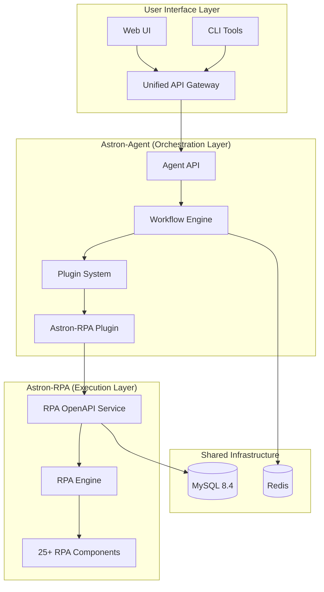

# Astron-RPA Integration Guide

This document provides comprehensive guidance for integrating Astron-RPA capabilities into Astron-Agent, creating a unified autonomous CI/CD system.

## 🎯 Overview

The Astron-RPA integration transforms Astron-Agent into a complete autonomous CI/CD platform by combining:

- **Astron-Agent**: Intelligent orchestration and workflow management
- **Astron-RPA**: Comprehensive automation execution with 25+ RPA components
- **Unified API**: Single interface for PRD-to-Project completion

## 🏗️ Architecture



## 🚀 Quick Start

### 1. Prerequisites

- Docker and Docker Compose
- Python 3.13+
- MySQL 8.4
- Redis 7

### 2. Environment Setup

```bash
# Clone the repository
git clone https://github.com/your-org/astron-agent.git
cd astron-agent

# Copy configuration template
cp core/agent/config.rpa.example .env

# Edit configuration
nano .env
```

### 3. Start the Integrated System

```bash
# Start all services
docker-compose -f docker/integration/docker-compose.yml up -d

# Check service health
curl http://localhost:8000/api/v1/rpa/health
```

### 4. Create Your First Project

```bash
# Create a project with PRD
curl -X POST "http://localhost:8000/api/v1/rpa/projects/create" \
  -H "Content-Type: application/json" \
  -d '{
    "name": "My First Project",
    "prd_content": "Create a web application with user authentication and dashboard",
    "project_config": {
      "target_url": "http://localhost:3000",
      "api_endpoints": ["/api/auth", "/api/dashboard"]
    }
  }'
```

## 🔧 Configuration

### Environment Variables

| Variable | Description | Default |
|----------|-------------|---------|
| `RPA_OPENAPI_URL` | RPA service URL | `http://astron-rpa:8020` |
| `RPA_INTEGRATION_ENABLED` | Enable RPA integration | `true` |
| `RPA_PARALLEL_EXECUTION` | Enable parallel workflows | `true` |
| `RPA_VALIDATION_TIMEOUT` | Validation timeout (seconds) | `300` |
| `RPA_CONFIDENCE_THRESHOLD` | Validation confidence threshold | `0.8` |

### Component Categories

#### UI Automation
- **Components**: `rpabrowser`, `rpacv`, `rpawindow`
- **Use Cases**: Web testing, UI validation, screenshot capture

#### API Testing
- **Components**: `rpanetwork`, `rpaopenapi`
- **Use Cases**: API validation, endpoint testing, integration testing

#### Data Processing
- **Components**: `rpadatabase`, `rpaexcel`, `rpapdf`, `rpadocx`
- **Use Cases**: Data validation, report generation, document processing

#### AI Processing
- **Components**: `rpaai`, `rpaverifycode`
- **Use Cases**: Intelligent validation, code verification, AI analysis

#### System Automation
- **Components**: `rpasystem`, `rpaencrypt`, `rpaemail`, `rpaenterprise`
- **Use Cases**: System monitoring, security operations, notifications

## 📋 API Reference

### Project Management

#### Create Project
```http
POST /api/v1/rpa/projects/create
Content-Type: application/json

{
  "name": "Project Name",
  "prd_content": "PRD document content",
  "project_config": {
    "target_url": "http://localhost:3000",
    "api_endpoints": ["/api/endpoint1"]
  }
}
```

#### Get Project Status
```http
GET /api/v1/rpa/projects/{project_id}
```

### Workflow Execution

#### Execute Workflow
```http
POST /api/v1/rpa/workflows/execute
Content-Type: application/json

{
  "project_id": "project-id",
  "workflow_type": "ui_validation",
  "component_category": "ui_automation",
  "parameters": {
    "target_url": "http://localhost:3000"
  }
}
```

#### Get Execution Status
```http
GET /api/v1/rpa/workflows/execution/{execution_id}
```

### Validation

#### Execute Validation
```http
POST /api/v1/rpa/validation/execute
Content-Type: application/json

{
  "project_id": "project-id",
  "task_result": {
    "deployment_url": "http://localhost:3000"
  },
  "expected_behavior": {
    "ui_requirements": ["login_form", "dashboard"]
  }
}
```

## 🔄 Workflow Examples

### PRD-to-Project Workflow

```python
import asyncio
from service.plugin.astron_rpa_plugin import AstronRpaPlugin
from service.mapping.component_mapper import ComponentMappingService

async def prd_to_project_workflow():
    # 1. Initialize services
    rpa_plugin = AstronRpaPlugin()
    mapping_service = ComponentMappingService()
    
    # 2. Process PRD
    prd_content = """
    Create a web application with:
    - User authentication system
    - Dashboard with analytics
    - API endpoints for data management
    """
    
    # 3. Generate workflow mappings
    mappings = await mapping_service.create_project_workflow_mappings(
        prd_content=prd_content,
        project_config={"target_url": "http://localhost:3000"},
        span=create_span("prd_processing")
    )
    
    # 4. Execute workflows
    for req_id, mapping in mappings["workflow_mappings"].items():
        result = await rpa_plugin.execute_component_workflow(
            component_category=mapping.component_category,
            workflow_config=RpaWorkflowConfig(
                workflow_type=mapping.workflow_type,
                components=mapping.components,
                parameters=mapping.parameters
            ),
            span=create_span(f"workflow_{req_id}")
        )
        print(f"Workflow {req_id}: {result.result}")

# Run the workflow
asyncio.run(prd_to_project_workflow())
```

### Custom Validation Workflow

```python
async def custom_validation_workflow():
    rpa_plugin = AstronRpaPlugin()
    
    # Define task result and expected behavior
    task_result = {
        "deployment_url": "http://localhost:3000",
        "api_url": "http://localhost:3000/api",
        "database_config": {"host": "localhost", "port": 3306}
    }
    
    expected_behavior = {
        "ui_requirements": ["login_form", "dashboard", "user_profile"],
        "api_requirements": [
            {"endpoint": "/api/auth", "method": "POST"},
            {"endpoint": "/api/users", "method": "GET"}
        ],
        "data_requirements": ["users_table", "sessions_table"]
    }
    
    # Execute comprehensive validation
    validation_result = await rpa_plugin.execute_autonomous_validation(
        task_result=task_result,
        expected_behavior=expected_behavior,
        span=create_span("validation")
    )
    
    print(f"Validation Result: {validation_result['overall_valid']}")
    for category, result in validation_result["validation_results"].items():
        print(f"  {category}: {'✅' if result.result.get('success') else '❌'}")
```

## 🔍 Monitoring and Observability

### Health Checks

```bash
# Check overall system health
curl http://localhost:8000/api/v1/rpa/health

# Check individual service health
curl http://localhost:8020/health  # RPA OpenAPI
curl http://localhost:8021/health  # RPA Engine
```

### Metrics and Monitoring

The integration includes comprehensive monitoring via Prometheus and Grafana:

```bash
# Start monitoring stack
docker-compose -f docker/integration/docker-compose.yml --profile monitoring up -d

# Access Grafana dashboard
open http://localhost:3000  # admin/admin123
```

### Logging

Structured logging is available for all components:

```bash
# View agent logs
docker logs astron-agent-api

# View RPA logs
docker logs astron-rpa-openapi
docker logs astron-rpa-engine
```

## 🧪 Testing

### Unit Tests

```bash
# Run agent tests
cd core/agent
python -m pytest tests/

# Run integration tests
python -m pytest tests/integration/test_rpa_integration.py
```

### Integration Tests

```bash
# Test full PRD-to-project workflow
python tests/integration/test_prd_workflow.py

# Test component mapping
python tests/integration/test_component_mapping.py
```

### Load Testing

```bash
# Install dependencies
pip install locust

# Run load tests
locust -f tests/load/test_rpa_integration.py --host=http://localhost:8000
```

## 🚨 Troubleshooting

### Common Issues

#### 1. RPA Service Connection Failed
```bash
# Check RPA service status
curl http://localhost:8020/health

# Check network connectivity
docker network ls
docker network inspect astron-integration-network
```

#### 2. Workflow Execution Timeout
```bash
# Increase timeout in configuration
export RPA_WORKFLOW_TIMEOUT=1200

# Check resource usage
docker stats
```

#### 3. Validation Failures
```bash
# Enable debug logging
export RPA_DEBUG_MODE=true
export RPA_DETAILED_LOGGING=true

# Check validation logs
docker logs astron-agent-api | grep validation
```

### Debug Mode

Enable comprehensive debugging:

```bash
# Set environment variables
export RPA_DEBUG_MODE=true
export LOG_LEVEL=DEBUG

# Restart services
docker-compose restart
```

## 🔒 Security

### Authentication

The integration supports multiple authentication methods:

```bash
# API Key authentication
export RPA_API_KEY=your-secure-api-key

# JWT authentication
export JWT_SECRET_KEY=your-jwt-secret
```

### Network Security

```bash
# Configure firewall rules
sudo ufw allow 8000  # Agent API
sudo ufw allow 8020  # RPA OpenAPI
sudo ufw deny 8021   # RPA Engine (internal only)
```

### Data Protection

- All sensitive data is encrypted at rest
- API communications use TLS
- Database connections are secured
- Secrets are managed via environment variables

## 📈 Performance Optimization

### Scaling Configuration

```yaml
# docker-compose.override.yml
services:
  astron-agent-api:
    deploy:
      replicas: 3
      resources:
        limits:
          cpus: '2'
          memory: 4G
  
  astron-rpa-engine:
    deploy:
      replicas: 2
      resources:
        limits:
          cpus: '4'
          memory: 8G
```

### Database Optimization

```sql
-- MySQL optimization
SET GLOBAL innodb_buffer_pool_size = 1073741824;  -- 1GB
SET GLOBAL max_connections = 500;
SET GLOBAL query_cache_size = 268435456;  -- 256MB
```

### Redis Configuration

```bash
# Redis optimization
redis-cli CONFIG SET maxmemory 512mb
redis-cli CONFIG SET maxmemory-policy allkeys-lru
```

## 🤝 Contributing

### Development Setup

```bash
# Clone repository
git clone https://github.com/your-org/astron-agent.git
cd astron-agent

# Create virtual environment
python -m venv venv
source venv/bin/activate

# Install dependencies
pip install -r requirements.txt
pip install -r requirements-dev.txt

# Run tests
pytest
```

### Code Style

```bash
# Format code
black core/agent/
isort core/agent/

# Lint code
flake8 core/agent/
mypy core/agent/
```

### Pull Request Process

1. Fork the repository
2. Create a feature branch
3. Make your changes
4. Add tests
5. Update documentation
6. Submit pull request

## 📚 Additional Resources

- [Astron-Agent Documentation](./AGENT_GUIDE.md)
- [Astron-RPA Documentation](./RPA_GUIDE.md)
- [API Reference](./API_REFERENCE.md)
- [Deployment Guide](./DEPLOYMENT_GUIDE.md)
- [Troubleshooting Guide](./TROUBLESHOOTING.md)

## 📄 License

This project is licensed under the MIT License - see the [LICENSE](../LICENSE) file for details.

## 🆘 Support

- **Issues**: [GitHub Issues](https://github.com/your-org/astron-agent/issues)
- **Discussions**: [GitHub Discussions](https://github.com/your-org/astron-agent/discussions)
- **Email**: support@astron-agent.com
- **Discord**: [Join our Discord](https://discord.gg/astron-agent)
