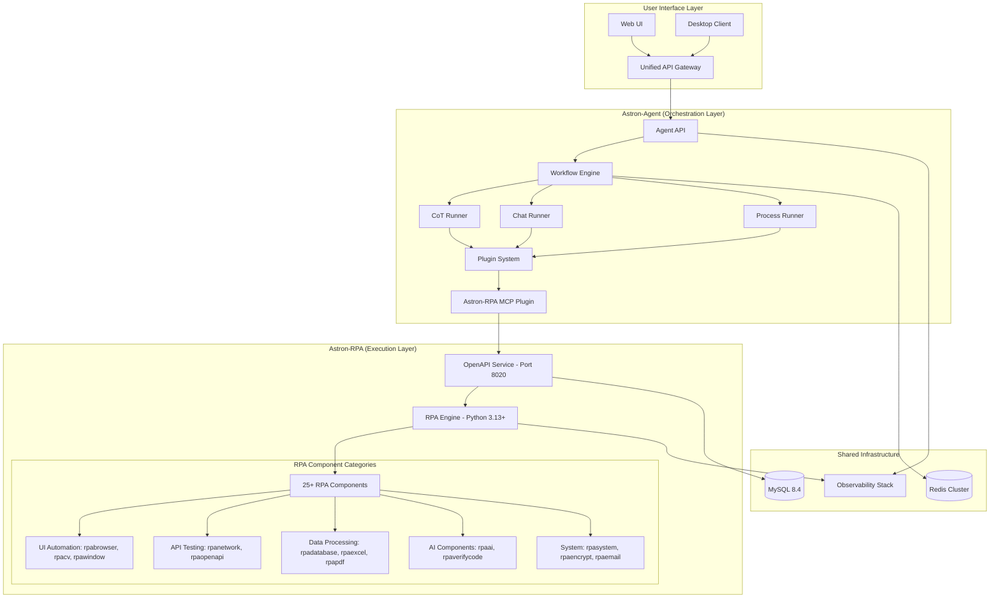

# 🤖 Astron-RPA Integration Guide

Complete guide for seamless integration between Astron-Agent and Astron-RPA, enabling autonomous CI/CD workflows with comprehensive validation capabilities.

## 🎯 Overview

This integration combines:
- **Astron-Agent**: Intelligent orchestration and workflow management
- **Astron-RPA**: 25+ automation components for comprehensive testing and validation
- **MCP Protocol**: Seamless communication bridge
- **Autonomous Workflows**: PRD-to-completion automation

## 🏗️ Architecture



## 🚀 Quick Start

### Prerequisites

1. **Docker & Docker Compose** (v3.8+)
2. **Python 3.11+** for development
3. **Node.js 18+** for web UI (optional)
4. **Git** for version control

### 1. Clone and Setup

```bash
# Clone the repository
git clone https://github.com/Zeeeepa/astron-agent.git
cd astron-agent

# Create environment configuration
cp .env.example .env
# Edit .env with your configuration
```

### 2. Environment Configuration

```bash
# .env file
MYSQL_ROOT_PASSWORD=root123
MYSQL_USER=astron
MYSQL_PASSWORD=astron123
REDIS_PASSWORD=redis123

# RPA Integration
RPA_OPENAPI_URL=http://astron-rpa-openapi:8020
RPA_INTEGRATION_ENABLED=true
RPA_DEBUG_MODE=false

# Optional: Monitoring
GRAFANA_PASSWORD=admin123
PROMETHEUS_PORT=9090
GRAFANA_PORT=3000

# Optional: Web UI
WEB_UI_PORT=3001
```

### 3. Deploy the Integrated System

```bash
# Deploy core services
docker-compose -f docker-compose.rpa-integration.yml up -d

# Optional: Deploy with monitoring
docker-compose -f docker-compose.rpa-integration.yml --profile monitoring up -d

# Optional: Deploy with web UI
docker-compose -f docker-compose.rpa-integration.yml --profile ui up -d

# Deploy everything
docker-compose -f docker-compose.rpa-integration.yml --profile monitoring --profile ui up -d
```

### 4. Verify Deployment

```bash
# Check service health
curl http://localhost:8000/health  # Astron-Agent
curl http://localhost:8020/health  # Astron-RPA OpenAPI
curl http://localhost:8021/health  # Astron-RPA Engine

# Check RPA integration
curl http://localhost:8000/api/v1/rpa/health
curl http://localhost:8000/api/v1/rpa/components/mapping
```

## 📋 API Usage

### 1. Create Project with PRD

```bash
curl -X POST "http://localhost:8000/api/v1/rpa/projects/create" \
  -H "Content-Type: application/json" \
  -d '{
    "name": "My Autonomous Project",
    "prd_content": "User should be able to login with email and password. The system should validate credentials and redirect to dashboard. API endpoints should return proper status codes.",
    "project_config": {
      "environment": "development",
      "validation_level": "comprehensive"
    }
  }'
```

Response:
```json
{
  "project_id": "proj_abc123",
  "status": "initializing",
  "message": "Project created successfully. PRD processing started.",
  "data": {
    "project_name": "My Autonomous Project",
    "prd_length": 156,
    "estimated_processing_time": "2-5 minutes"
  }
}
```

### 2. Check Project Status

```bash
curl "http://localhost:8000/api/v1/rpa/projects/proj_abc123"
```

Response:
```json
{
  "project_id": "proj_abc123",
  "status": "ready",
  "message": "Project My Autonomous Project status: ready",
  "data": {
    "name": "My Autonomous Project",
    "created_at": 1703123456,
    "prd_length": 156,
    "workflow_mappings_count": 3,
    "execution_plan": {
      "total_workflows": 3,
      "estimated_duration": 720
    }
  }
}
```

### 3. Execute Workflow

```bash
curl -X POST "http://localhost:8000/api/v1/rpa/workflows/execute" \
  -H "Content-Type: application/json" \
  -d '{
    "project_id": "proj_abc123",
    "workflow_type": "ui_validation",
    "component_category": "ui_testing",
    "parameters": {
      "target_url": "http://localhost:3000/login",
      "validation_rules": ["form_validation", "redirect_validation"]
    },
    "timeout": 300
  }'
```

### 4. Execute Autonomous Validation

```bash
curl -X POST "http://localhost:8000/api/v1/rpa/validation/execute" \
  -H "Content-Type: application/json" \
  -d '{
    "project_id": "proj_abc123",
    "task_result": {
      "implementation_status": "completed",
      "features_implemented": ["login", "dashboard", "api_endpoints"]
    },
    "expected_behavior": {
      "ui": {
        "target_url": "http://localhost:3000",
        "elements": ["login_form", "dashboard"],
        "rules": ["responsive", "accessible"]
      },
      "api": {
        "endpoints": ["/api/auth/login", "/api/dashboard"],
        "responses": {"login": 200, "dashboard": 200}
      }
    }
  }'
```

## 🔧 Component Mapping

### Available RPA Components

| Category | Components | Use Cases |
|----------|------------|-----------|
| **UI Testing** | `rpabrowser`, `rpacv`, `rpawindow` | Web automation, UI validation, screenshot capture |
| **API Testing** | `rpanetwork`, `rpaopenapi` | API validation, endpoint testing, integration testing |
| **Data Processing** | `rpadatabase`, `rpaexcel`, `rpapdf`, `rpadocx` | Data validation, report generation, document processing |
| **AI Processing** | `rpaai`, `rpaverifycode` | Intelligent validation, code verification, AI analysis |
| **System Automation** | `rpasystem`, `rpaencrypt`, `rpaemail`, `rpaenterprise` | System monitoring, security operations, notifications |

### Intelligent Requirement Mapping

The system automatically maps PRD requirements to appropriate RPA components:

```python
# Example mapping logic
requirement_patterns = {
    "ui": ["user interface", "ui", "frontend", "web page", "form"],
    "api": ["api", "endpoint", "service", "rest", "microservice"],
    "data": ["database", "data", "storage", "report", "analytics"],
    "ai": ["intelligent", "smart", "ai", "machine learning"],
    "system": ["system", "infrastructure", "deployment", "monitoring"]
}
```

## 🔄 Workflow Engine Integration

### Using RPA Nodes in Workflows

```yaml
# Example workflow configuration
workflow:
  name: "autonomous_validation_workflow"
  steps:
    - name: "process_prd"
      type: "rpa"
      operation: "process_prd"
      config:
        prd_content: "${input.prd_content}"
        project_config: "${input.project_config}"
    
    - name: "execute_ui_validation"
      type: "rpa"
      operation: "execute_workflow"
      config:
        component_category: "ui_testing"
        workflow_type: "ui_validation"
        parameters:
          target_url: "${input.target_url}"
          validation_rules: ["responsiveness", "accessibility"]
    
    - name: "execute_api_validation"
      type: "rpa"
      operation: "execute_workflow"
      config:
        component_category: "api_testing"
        workflow_type: "api_validation"
        parameters:
          endpoints: "${input.api_endpoints}"
    
    - name: "comprehensive_validation"
      type: "rpa"
      operation: "validate_implementation"
      config:
        task_result: "${steps.execute_ui_validation.result}"
        expected_behavior: "${input.expected_behavior}"
```

### Programmatic Usage

```python
from engine.nodes.rpa import RpaNode
from service.plugin.astron_rpa_plugin import AstronRpaPlugin

# Create RPA node
rpa_node = RpaNode(
    node_id="rpa_validation_node",
    rpa_openapi_url="http://astron-rpa:8020"
)

# Execute in workflow
async for response in rpa_node.run(span, node_trace):
    print(f"RPA Response: {response.content}")
```

## 🔍 Autonomous Validation

### Validation Strategies

The system supports three validation strategies:

1. **Basic** (Complexity < 0.4): Essential validations only
2. **Standard** (Complexity 0.4-0.7): Comprehensive testing
3. **Comprehensive** (Complexity > 0.7): Full validation suite with stress testing

### Validation Components

```python
# UI Validation
ui_validation = {
    "components": ["rpabrowser", "rpacv", "rpawindow"],
    "checks": [
        "element_presence",
        "functionality",
        "responsiveness",
        "accessibility"
    ]
}

# API Validation
api_validation = {
    "components": ["rpanetwork", "rpaopenapi"],
    "checks": [
        "response_validation",
        "status_codes",
        "performance",
        "security"
    ]
}

# Integration Validation
integration_validation = {
    "components": ["rpasystem", "rpadatabase"],
    "checks": [
        "data_integrity",
        "system_health",
        "performance_thresholds"
    ]
}
```

## 📊 Monitoring & Observability

### Access Points

- **Grafana Dashboard**: http://localhost:3000 (admin/admin123)
- **Prometheus Metrics**: http://localhost:9090
- **Astron-Agent API**: http://localhost:8000
- **Astron-RPA API**: http://localhost:8020
- **Web UI**: http://localhost:3001 (if enabled)

### Key Metrics

```yaml
# Prometheus metrics
astron_agent_requests_total: Total API requests
astron_agent_request_duration: Request duration
astron_rpa_workflow_executions_total: Total workflow executions
astron_rpa_workflow_success_rate: Workflow success rate
astron_rpa_component_usage: Component usage statistics
```

### Health Checks

```bash
# Service health
curl http://localhost:8000/health
curl http://localhost:8020/health
curl http://localhost:8021/health

# Integration health
curl http://localhost:8000/api/v1/rpa/health

# Component mapping
curl http://localhost:8000/api/v1/rpa/components/mapping
```

## 🛠️ Development

### Local Development Setup

```bash
# Install dependencies
pip install -r requirements.txt

# Set up development environment
export RPA_OPENAPI_URL=http://localhost:8020
export RPA_INTEGRATION_ENABLED=true
export RPA_DEBUG_MODE=true

# Run Astron-Agent
python core/agent/api/app.py

# Run tests
python -m pytest tests/integration/test_rpa_integration.py -v
```

### Adding New RPA Components

1. **Register Component in Mapping**:
```python
# service/mapping/component_mapper.py
self.component_capabilities["new_category"] = {
    "components": ["rpa_new_component"],
    "capabilities": ["new_capability"],
    "use_cases": ["new_use_case"]
}
```

2. **Update Plugin Configuration**:
```python
# service/plugin/astron_rpa_plugin.py
self.component_mapping["new_category"] = ["rpa_new_component"]
```

3. **Add Workflow Support**:
```python
# engine/nodes/rpa/rpa_node.py
# Add new operation support in supported_operations list
```

### Testing

```bash
# Unit tests
python -m pytest tests/unit/test_rpa_plugin.py -v

# Integration tests
python -m pytest tests/integration/test_rpa_integration.py -v

# End-to-end tests
python -m pytest tests/e2e/test_autonomous_workflow.py -v

# Load tests
python -m pytest tests/load/test_rpa_performance.py -v
```

## 🚨 Troubleshooting

### Common Issues

#### 1. RPA Service Connection Failed

```bash
# Check service status
docker-compose -f docker-compose.rpa-integration.yml ps

# Check logs
docker-compose -f docker-compose.rpa-integration.yml logs astron-rpa-openapi

# Test connectivity
curl http://localhost:8020/health
```

#### 2. MCP Communication Issues

```bash
# Check MCP endpoint
curl http://localhost:8020/mcp

# Verify plugin configuration
curl http://localhost:8000/api/v1/rpa/health

# Check logs
docker-compose -f docker-compose.rpa-integration.yml logs astron-agent
```

#### 3. Workflow Execution Failures

```bash
# Check execution status
curl http://localhost:8000/api/v1/rpa/workflows/execution/{execution_id}

# Review component logs
docker-compose -f docker-compose.rpa-integration.yml logs astron-rpa-engine

# Verify component availability
curl http://localhost:8000/api/v1/rpa/components/mapping
```

### Debug Mode

Enable debug mode for detailed logging:

```bash
# Environment variable
export RPA_DEBUG_MODE=true

# Or in docker-compose
environment:
  - RPA_DEBUG_MODE=true
  - LOG_LEVEL=DEBUG
```

### Performance Tuning

```yaml
# docker-compose.rpa-integration.yml
environment:
  - RPA_MAX_CONCURRENT_WORKFLOWS=10
  - RPA_WORKFLOW_TIMEOUT=600
  - RPA_PARALLEL_EXECUTION=true
```

## 🔐 Security

### Authentication

```bash
# Set API key for RPA service
export RPA_API_KEY=your-secure-api-key

# Configure in project creation
{
  "api_key": "your-secure-api-key",
  "rpa_service_url": "https://secure-rpa-service.com"
}
```

### Network Security

```yaml
# docker-compose.rpa-integration.yml
networks:
  astron-network:
    driver: bridge
    internal: true  # Isolate from external networks
```

### Data Protection

- All sensitive data is encrypted in transit
- Database credentials are managed via environment variables
- API keys are never logged or exposed
- Component execution is sandboxed

## 📈 Performance

### Optimization Tips

1. **Parallel Execution**: Enable parallel workflow execution
2. **Component Caching**: Cache frequently used components
3. **Resource Limits**: Set appropriate memory and CPU limits
4. **Connection Pooling**: Use connection pooling for database access

### Scaling

```yaml
# Horizontal scaling
services:
  astron-agent:
    deploy:
      replicas: 3
  
  astron-rpa-engine:
    deploy:
      replicas: 5
```

## 🤝 Contributing

1. Fork the repository
2. Create a feature branch
3. Implement changes with tests
4. Submit a pull request

### Development Guidelines

- Follow existing code patterns
- Add comprehensive tests
- Update documentation
- Ensure backward compatibility

## 📚 Additional Resources

- [Astron-Agent Documentation](./AGENT_GUIDE.md)
- [Astron-RPA Documentation](https://github.com/Zeeeepa/astron-rpa/blob/main/README.md)
- [MCP Protocol Specification](https://modelcontextprotocol.io/)
- [Docker Compose Reference](https://docs.docker.com/compose/)

## 🆘 Support

- **GitHub Issues**: [Create an issue](https://github.com/Zeeeepa/astron-agent/issues)
- **Documentation**: [View docs](./README.md)
- **Examples**: [View examples](./examples/)

---

**🚀 Ready to build autonomous CI/CD systems with Astron-Agent + Astron-RPA integration!**
